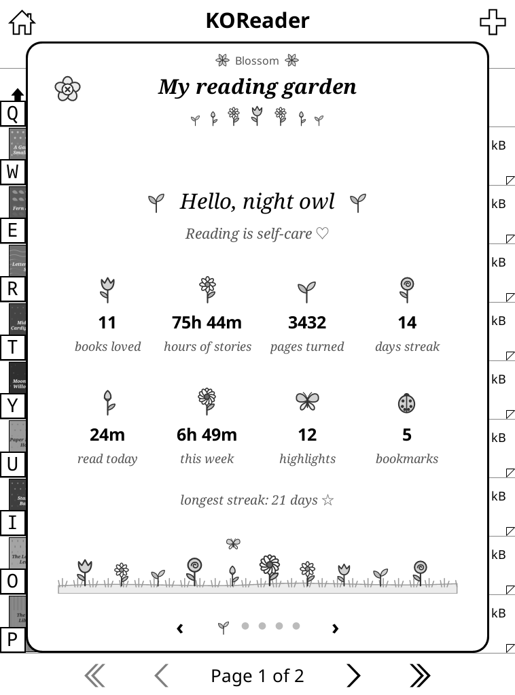
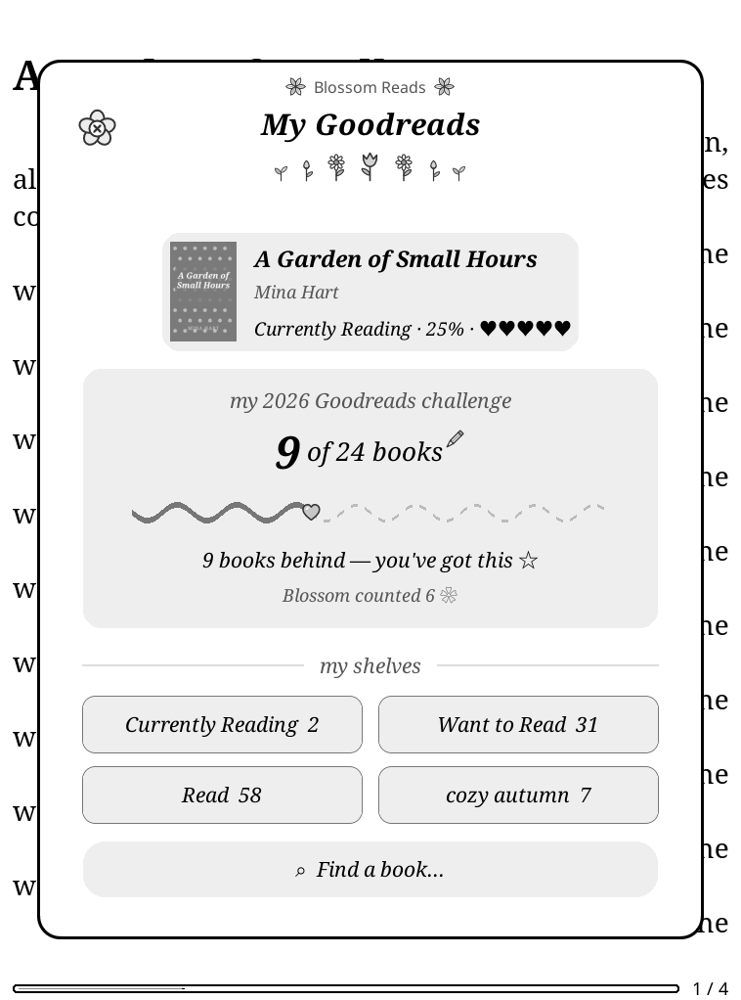
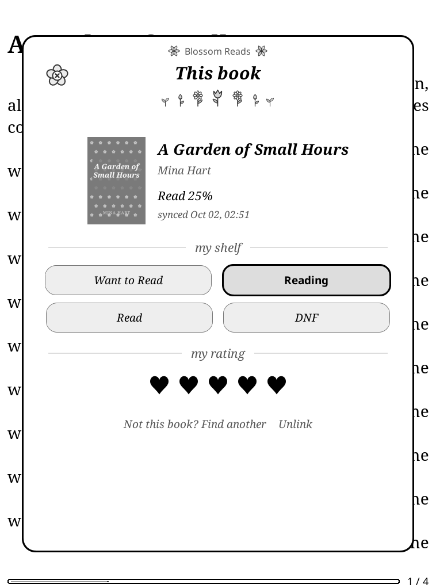
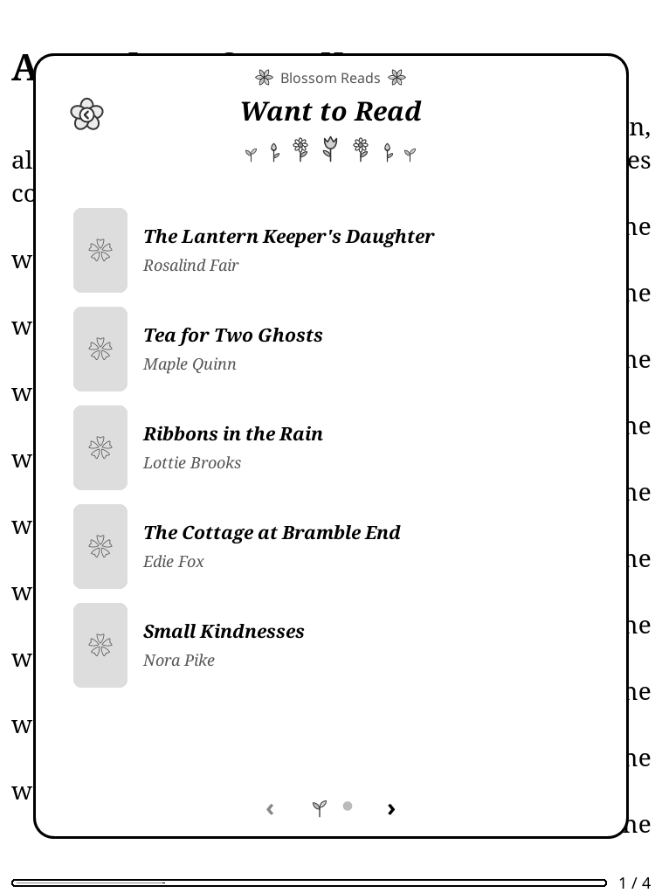

# 🌸 Blossom: a cute reading diary for KOReader

**Your reading statistics, but make it a garden.** Blossom turns the numbers KOReader already
collects into a soft little reading diary: streaks, weekly blooms, a shelf of covers, a month
calendar, a yearly goal and all your highlights, drawn in gentle grays for e-ink.

<p align="center">
  
  
  
</p>

<sub>Screenshots use a made-up demo library: every title, author, cover and quote is invented.</sub>

This repo holds two sister plugins:

| Plugin | What it does |
|---|---|
| 🌸 **Blossom** (`blossom.koplugin`) | Your reading diary, from KOReader's statistics |
| 🌼 **Blossom Reads** (`blossomreads.koplugin`) | Goodreads sync (progress, shelves, collections, ratings, challenge), in the same style. [Full guide →](docs/blossom-reads.md) |

---

## 🌷 What's inside

Blossom opens as a full-screen diary with five pages. Swipe left or right, or use the page-turn
buttons, to move between them. The dots at the bottom show where you are, and a little sprout
marks the current page.

### My reading garden


- A greeting for the time of day, between two sprouts, with a daily affirmation.
- **Eight numbers, each growing its own drawn flower:** books loved 🌷, hours of stories 🌼,
  pages turned 🌱, day streak 🌹, read today, this week 🌻, highlights 🦋 and bookmarks 🐞.
- Your longest streak, and a little flower bed along the bottom.
- **Tap any number** to open its own page:
  - **Books loved, hours of stories, pages turned, day streak, read today, this week:** a cover gallery,
    8 books per page, sorted to match (most recent, most time, most pages …).
  - **Highlights:** every highlight as a quote, with the book, page, date and your ✎ note.
  - **Bookmarks:** your bookmarks and highlights together, newest first, like KOReader's own bookmarks list.

<br clear="right">

<p align="center">
  
  
  
</p>

### This week


- Minutes read on each of the last 7 days, with a ♥ over your best day.
- Your total for the week and your best day.
- **Books that kept me company:** the covers of what you read this week, with **See more …** for the rest.

<br clear="right">

### My books


- Your 8 most recent books (4×2): books you've spent **more than an hour** with.
  **See more …** opens **All my books**, the whole shelf, 8 per page.
- Each cover sits edge to edge in a rounded frame, with its title, **% read** and **time spent** below.
- Finished books get a little 🎀 bow.

<br clear="right">

### This month

<p>
  
  
</p>

- Switch views with the icons beside the month: **▦ calendar** and a 🌹 **rose for covers**.
- **Covers:** the books you read that month, as a gallery.
- **Calendar:** Sunday-first and shaded by how long you read each day.
  - **Book bars** (title · time) stretch across the days you kept reading a book.
  - When books overlap, their bars stack.
- ‹ › take you back through earlier months.
- **Tap a day** to open that day's page.

### My year


- Your **yearly reading goal** (books finished): a wavy line with a heart riding along it.
- A status line, for example "67% of my goal · right on track".
- Tap the little ✎ pencil to change your goal.
- Your year in numbers: time, pages and days.
- A **line chart** of reading by month, with a ♥ over your best month.

<br clear="right">

### Book details


Tap any book, anywhere, to open it:

- **Top:** the cover, title, author, a short snippet of the book's description, a wavy progress
  line and "66% read · 250 of 380 pages".
- **My reading:** time together, reading days, pages per hour, time left, highlights and bookmarks.
- **My highlights:** your highlights from this book, shown exactly as in the book.
- The page scrolls when it's taller than the screen or window. Swipe up or down on it.

<br clear="right">

### A day


Tap a day in the calendar to see:

- time read, pages, highlights and bookmarks for that day
- the covers of the books you read
- the highlights and bookmarks you made that day

<br clear="right">

### Open it your way



Everything is in **Tools (🔧) → ❀ Blossom reading diary**:

- **Open Blossom.**
- **This book in Blossom:** while reading, jumps straight to the details of the book you're in.
- **Open as:**
  - **Full screen.**
  - **Floating window** over your bookshelf or the book you're reading. Tap outside the window to close it.
- **Start on:** which page opens first: My reading garden, This week, My books, This month, My year,
  or *the book I'm reading*.
- **Yearly goal:** change it here, or with the ✎ on My year.

Both **Blossom reading diary** and **This book in Blossom** can be bound to a gesture.

**Using Simple UI?** Add Blossom as a quick action of type **System action → Blossom reading diary**
(or **This book in Blossom**), not as a *plugin* action. Simple UI's plugin actions only find plugins
while the bookshelf is open, so inside a book they say "Plugin not available". System actions work everywhere.

<br clear="right">

### Getting around

- **Paging:** every gallery and list pages the same way: soft dots, a little sprout for the page
  you're on, and ‹ › either side. Long lists show a window of dots plus a small "12 / 40".
- **Close:** swipe down, press Back, or tap the little flower **×** at the top-left.
- **Go back:** pages you open from the dashboard have a flower **‹** in the same spot.

---

## 💕 Install

1. Download or copy the `blossom.koplugin` folder, including its `icons` folder.
2. Connect your e-reader by USB and copy the folder into KOReader's `plugins` folder
   (for example `koreader/plugins/` on Kindle and Kobo).
3. Restart KOReader.
4. Open **Tools (🔧) → ❀ Blossom reading diary**.

Tip: bind it to a gesture in **Settings → Taps and gestures → Gesture manager**
(**General → Blossom reading diary**, or **This book in Blossom** while reading).

## 🎀 Good to know

- **Statistics:** Blossom reads the **Statistics** plugin's data, so keep that plugin enabled
  (it is by default). Blossom never changes your statistics.
- **What it saves:** only its own settings, under `blossom` in KOReader's settings:
  - `yearly_goal` (default 12)
  - `open_as` (`fullscreen` or `window`)
  - `start_page`
- **Covers:** they come from the Cover Browser cache when available, otherwise from the book file.
  Books that were moved or deleted get a soft placeholder tile instead.
- **Highlights, bookmarks and snippets:** these come from each book's KOReader sidecar (`.sdr`).
  Only books in your reading history are read. If you open Blossom while reading, it saves the open
  book's notes first, so today's highlights show up.
- **Finished books:** a book counts as finished at 98% of its pages. For the yearly goal, it counts
  in the year you last read it.
- **Look:** everything is grayscale and drawn for e-ink. Page changes use a full refresh, so there's
  no ghosting.

---

## 🌼 Blossom Reads: Goodreads, the Blossom way

**Blossom Reads** (`blossomreads.koplugin`) is Blossom's sister plugin. It keeps your reading in sync
with Goodreads, and every screen floats over your book in Blossom's soft style.

<p align="center">
  
  
  
</p>

- **Syncs like iCloud Sync:**
  - quietly, when Wi-Fi connects, on wake and when you close a book, or whenever you tap
    *Sync now*
  - Goodreads hiccups are retried up to 3 times
  - books that still fail are tried again at the next sync
- **Progress and status:** progress only ever goes up. Starting a book moves it to *Currently
  Reading*; finishing it moves it to *Read*.
- **Collections become shelves:** *To Be Read* → Want to Read, *favorites* → a favorites shelf,
  any other collection → a shelf of the same name. Your real reading status always wins.
  Custom shelves are kept matched (removed when the book leaves the collection).
- **Every book gets linked:** by ISBN, its details, or a `Title - Author.epub` file name, a few
  per sync.
- **This book, shelves, search and your reading challenge,** as floating Blossom pages. With
  Blossom installed, the yearly goal stays the same in both.

**Install:**
1. Copy `blossomreads.koplugin` into KOReader's `plugins` folder.
2. Restart KOReader.
3. Sign in from **Tools → ❀ Blossom Reads**.

If you used Goodreads KO Sync, turn it off.

📖 **[Read the full Blossom Reads guide](docs/blossom-reads.md):**
- every setting
- how matching works
- collections in detail
- messages and troubleshooting
- what's stored, and privacy

---

## 🧁 Development

Tests run with plain LuaJIT from the repo root:

```bash
luajit tests/test_data.lua
```

```bash
luajit tests/test_plugin_load.lua
```

Blossom Reads has its own suites:

```bash
for t in core plan engine load; do luajit tests/test_blossomreads_$t.lua; done
```

And so does Zero Clicker:

```bash
for t in core load; do luajit tests/test_zeroclicker_$t.lua; done
```

`test_plugin_load.lua` builds every page against stand-ins for KOReader's modules. To see the
real thing, `tools/screenshots.sh` builds the made-up demo library, runs the KOReader macOS
build with it and saves every page to `docs/screenshots/`:

```bash
tools/screenshots.sh ~/Applications/KOReader.app
```

| File | What it does |
|------|--------------|
| `main.lua` | Menu, gesture action and database queries |
| `blossom_data.lua` | Pure calculations: streaks, weeks, months, calendar, goal, spans, snippets |
| `blossom_view.lua` | The five dashboard pages |
| `blossom_detail.lua` | Book details |
| `blossom_day.lua` | A day's books, highlights and bookmarks |
| `blossom_more.lua` | The garden's gallery and list pages |
| `blossom_covers.lua` | Matches statistics entries to book files and covers |
| `blossom_theme.lua` | Grays, fonts, header, wavy line, quotes and other shared pieces |
| `icons/` | The drawn bow, heart, pencil, close and back flowers, and garden flowers |
| `tools/make_garden_icons.py` | Redraws the flower icons |
| `tools/make_demo.py` | Builds the demo library (fictional books, drawn covers) |
| `tools/screenshots.sh` | Rebuilds `docs/screenshots/` in the KOReader macOS build |
| `blossomreads.koplugin/main.lua` | Blossom Reads: settings, sync triggers, menu, sign-in dialogs |
| `blossomreads_plan.lua` / `_engine.lua` | Pure sync and goal decisions, and running them |
| `blossomreads_login.lua` / `_http.lua` / `_api.lua` | Goodreads sign-in, cookie jar, the Goodreads calls |
| `blossomreads_identify.lua` | Matching a book to Goodreads by ISBN, ASIN or title and author |
| `blossomreads_store.lua` / `_secret.lua` / `_covers.lua` | Files, encryption, cover cache |
| `blossomreads_view.lua` / `_book.lua` / `_list.lua` / `_theme.lua` | The floating Blossom pages |
| `tools/screenshots_reads.sh` | Blossom Reads screenshots with made-up Goodreads data |
| `zeroclicker.koplugin/main.lua` | Zero Clicker: claims the controller, takes its events, button learning, menu |
| `zeroclicker_core.lua` | Pure press detection (keys and D-pad axes), default buttons, name matching |
