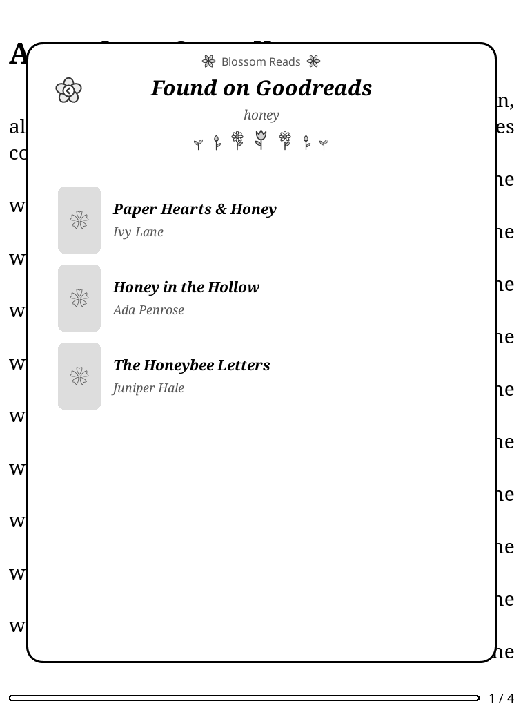
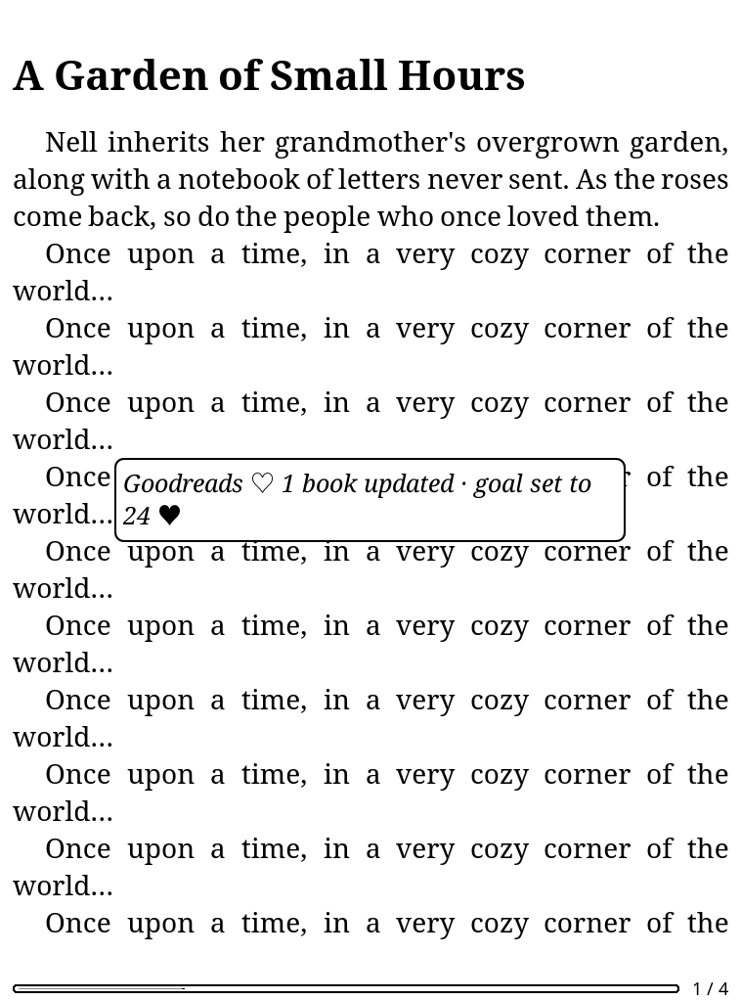

# 🌼 Blossom Reads — the full guide

Blossom Reads keeps KOReader and Goodreads in step: reading progress, shelves, ratings,
your KOReader collections and your yearly reading challenge. Every screen floats over your
book in Blossom's soft, grayscale style. It's built for e-ink readers, and it stays quiet
unless there's something worth telling you.

<p align="center">
  
  
  
</p>
<p align="center">
  
  
</p>

*The screenshots use a made-up library and made-up Goodreads data.*

---

## Contents

1. [Install](#install)
2. [Signing in](#signing-in)
3. [What syncs, and when](#what-syncs-and-when)
4. [Collections → Goodreads shelves](#collections--goodreads-shelves)
5. [How books are matched to Goodreads](#how-books-are-matched-to-goodreads)
6. [The screens](#the-screens)
7. [Your yearly goal and Blossom](#your-yearly-goal-and-blossom)
8. [Settings, one by one](#settings-one-by-one)
9. [Messages you might see](#messages-you-might-see)
10. [Troubleshooting](#troubleshooting)
11. [What it stores, and privacy](#what-it-stores-and-privacy)
12. [Uninstall](#uninstall)
13. [For developers](#for-developers)

---

## Install

1. Copy the `blossomreads.koplugin` folder (with its `icons` folder) into KOReader's `plugins`
   folder:
   - Kindle: `koreader/plugins/`
   - Kobo: `.adds/koreader/plugins/`
2. Restart KOReader.
3. Open **Tools (🔧) → ❀ Blossom Reads**.

Blossom Reads doesn't need [Blossom](../README.md), but it gets along with it nicely (see
[Your yearly goal and Blossom](#your-yearly-goal-and-blossom)).

> **Coming from Goodreads KO Sync?** Disable or remove `goodreadskosync.koplugin`, otherwise
> both plugins will sync the same books.

## Signing in

**Tools → ❀ Blossom Reads → Sign in to Goodreads**: enter the email and password of your
Goodreads (Amazon) account.

Amazon sometimes asks for more:
- **A verification code** (sent by email or text): Blossom Reads asks for it, and you type it in.
- **A picture puzzle** ("type the characters you see"): the picture is shown. Close it, then type
  the characters.
- **A check that can only be done in a browser:** you'll see *"Goodreads asked for a check that
  can't be done here"*. Wait a while, or sign in from another network, then try again.

Once signed in, the menu shows **Signed in as** and your Goodreads user number. With
**Remember password** on (the default), the password is saved, encrypted, so you won't need
to type it again if Goodreads signs you out later.

## What syncs, and when

Blossom Reads syncs the way the iCloud Sync plugin does: quietly, in the background, at
sensible moments.

| When | What happens |
|------|--------------|
| **Wi-Fi connects** | Books whose reading progress changed since the last sync, your collections and the yearly goal |
| **Waking up** (only if Wi-Fi is already on) | The same; it never turns Wi-Fi on by itself |
| **Closing a book** (only if Wi-Fi is on) | That book only, straight away |
| **Sync now** (menu or gesture) | Everything; Wi-Fi is turned on if needed |

- **At most every 5 minutes, never two at once.** Automatic syncs (Wi-Fi, wake) wait 5 minutes
  between runs, and a sync never starts while another is running.
- **Quiet:** an automatic sync shows a small note only when something actually changed, such as
  *"Goodreads ♡ 2 books updated"*. Problems during automatic syncs are only written to the
  log, never shown as pop-ups.
- **Goodreads hiccups are retried.** Each request is tried up to 3 times (with short pauses) when
  Goodreads is over capacity, rate-limiting or drops the connection. A book that still fails
  is simply tried again at the next sync. There's no queue to manage.

### What gets sent for each book

| On your e-reader | On Goodreads |
|---|---|
| You start a book (progress above 0%) | Moved to **Currently Reading** |
| You read further | **Progress** updated (whole percent). It only ever goes *up*: re-reading never moves Goodreads backwards |
| You mark it finished in KOReader (book status "Finished") | Moved to **Read** |
| You reach 99% and **Mark Read at 99%** is on | Moved to **Read** |
| You mark it "On hold" | Nothing changes. Pick *DNF* yourself on the This book card if you want |
| You pick a shelf yourself on the This book card | That shelf is kept. Automatic *Currently Reading* won't override it, but finishing the book still marks it Read |
| You rate it with hearts on the This book card | The star rating on Goodreads |

## Collections → Goodreads shelves

KOReader **collections** (long-press a book → *Add to collection*) are mirrored onto Goodreads
shelves.

| Collection name | Goodreads shelf |
|---|---|
| To Be Read, TBR, Want to Read, To Read | **Want to Read** |
| Currently Reading, Reading | **Currently Reading** |
| Read, Finished, Done | **Read** |
| DNF, Did Not Finish | **Did Not Finish** |
| favorites (KOReader's built-in collection) | a **favorites** shelf |
| anything else, e.g. "Cozy Autumn" | a shelf with the same name: **cozy-autumn** |

Names are matched without caring about capitals or punctuation. Goodreads creates a new shelf
the first time a book is added to it.

**Your reading status always wins.** Goodreads keeps one *status* shelf per book (Want to Read,
Currently Reading, Read or Did Not Finish), and your actual reading decides it:
- A book in **To Be Read** that you haven't started → **Want to Read**.
- The same book once you start it → **Currently Reading**, and **Read** when you finish.
  Leaving it in your TBR collection doesn't move it back.
- A book in both TBR and DNF (unstarted) → **Did Not Finish**. The stronger status wins:
  Read > Currently Reading > DNF > Want to Read.

**Other shelves are kept matched.** Shelves like *favorites* or *cozy-autumn* are added
alongside the status. When you take a book out of the collection, it's taken off that
Goodreads shelf too. Blossom Reads only ever removes books from shelves it added them to, and
it never removes status shelves.

You can change any of this in **Collections → shelves**: send a collection to a different
shelf, to a shelf of your own naming, or not at all.

## How books are matched to Goodreads

Each book on your e-reader has to be **linked** to its Goodreads book before it can sync.
Blossom Reads does this by itself:

- **When:** on every sync, a few books at a time (8 per sync, so it never takes long). It starts
  with books in your collections, then your reading history. A book is also linked when you
  open it while Wi-Fi is on.
- **How:**
  1. The book's **ISBN or ASIN**, if it has one. Goodreads finds that exact edition.
  2. Otherwise its **title and author**: from the book's own details, from the Cover Browser
     cache, or from the file name. File names like
     `(2) Moonlit Orchard - Juniper Hale.epub` (*Title - Author*, with an optional `(n)` series
     number) work well.
  3. A title-and-author match is only linked automatically when it's exact and there's one
     clear best result.
- **No clear match?** The book is left unlinked and isn't searched again for a week. Link it
  yourself: open it, then **This book → Find on Goodreads**.
- **Wrong match?** **This book → Not this book? Find another**, or **Unlink**.

## The screens

All screens float over your book or bookshelf. Tap outside one, swipe down, or tap the flower
**×** to close it. Swipe left and right (or use the page keys) to turn pages in lists.

- **My Goodreads** (**Open Blossom Reads**):
  - **This book:** cover, title, author, shelf, progress and your hearts. Tap it to open the
    This book card.
  - **My Goodreads challenge:** books read of your goal, the wavy pace line with a heart, and
    whether you're ahead or behind. Tap the pencil to change the goal. With Blossom installed,
    *"Blossom counted N ❀"* shows Blossom's own count.
  - **My shelves:** your shelves with counts. Tap one to browse it.
  - **Find a book…:** search Goodreads by title, author or ISBN.
- **This book:** the Goodreads match, *my shelf* (Want to Read · Reading · Read · DNF), *my
  rating* (tap a heart), and *Not this book? Find another* or *Unlink*.
- **A shelf / search results:** books with covers, page by page. Tap a book to put it on one of
  your shelves.

## Your yearly goal and Blossom

If [Blossom](../README.md) is installed, **Share my yearly goal with Blossom** (on by default)
keeps Blossom's yearly goal and your Goodreads reading challenge goal the same:

- Change it in Blossom → Goodreads follows at the next sync.
- Change it on Goodreads → Blossom follows.
- Changed in both places since the last sync → Goodreads wins.
- No Goodreads challenge yet → Blossom's goal starts one.
- Blossom's goals stop at 365. A bigger Goodreads goal shows as 365 in Blossom and is never sent
  back as 365.

The *books read* numbers aren't merged. Goodreads counts your Read shelf; Blossom counts books
it saw you finish in KOReader's statistics. The challenge card shows both.

## Settings, one by one

**Tools → ❀ Blossom Reads**:

| Item | What it does | Default |
|---|---|---|
| **Sync now** | Sync everything now (turns Wi-Fi on if needed) | — |
| **Last sync: …** | When the last sync ran and what it did. Tap it to see why it failed | — |
| **Open Blossom Reads** | The My Goodreads screen | — |
| **This book** | The This book card (while reading) | — |
| **Sync when Wi-Fi connects** | Automatic sync when Wi-Fi comes on | On |
| **Sync on wake** | Automatic sync on wake, if already online | On |
| **Sync when closing a book** | Send that book when you close it, if online | On |
| **Link books automatically** | Link books by ISBN / title and author | On |
| **Sync collections to shelves** | Mirror KOReader collections onto Goodreads shelves | On |
| **Collections → shelves** | Per collection: Automatic, a status shelf, another shelf, or Don't sync | Automatic |
| **Mark Read at 99%** | Treat 99% as finished | Off |
| **Share my yearly goal with Blossom** | Keep Blossom's goal and the Goodreads goal equal (only shown with Blossom installed) | On |
| **Sign in / Signed in as …** | Sign in, or sign out | — |
| **Remember password** | Keep the password, encrypted. Turning it off deletes it | On |

**Gestures** (Settings → Taps and gestures → Gesture manager → General):
- *Blossom Reads: sync now*
- *Blossom Reads: open*
- *Blossom Reads: this book* (while reading)

## Messages you might see

| Message | What it means | What to do |
|---|---|---|
| *Goodreads ♡ 2 books updated · 3 books linked* | A sync sent changes | Nothing ♡ |
| *Up to date ♡* | Nothing needed sending | Nothing |
| *Couldn't sync — no Wi-Fi ☆* | Goodreads couldn't be reached | Turn Wi-Fi on; it'll catch up |
| *Goodreads is busy right now, please try again later ☆* | Goodreads' firewall asked for a check | Try later; you stay signed in |
| *Goodreads didn't answer properly ☆* | Goodreads failed 3 times in a row on something you tapped | Try again in a minute. Details are in the log |
| *Goodreads asked you to sign in again ♡* | The Goodreads session ended | **Sign in again to Goodreads** in the menu |
| *That email or password didn't work ☆* | The sign-in was refused | Check them; try signing in on goodreads.com |
| *Goodreads showed a page Blossom Reads doesn't know yet ☆* | Amazon's sign-in pages changed | Please report it (see below) |

## Troubleshooting

**My books don't sync.**
- Check that you're signed in: the menu should say *Signed in as …*.
- Run **Sync now**. The note says how many books were updated and linked.
- Only linked books sync. Open the book and check **This book**. If it says *Not linked yet*,
  tap **Find on Goodreads**.

**A book is on the wrong shelf.**
- Pick the right one on **This book**. A shelf you pick yourself is kept.

**Something failed and I want to know why.**
- Tap **Last sync** in the menu.
- For details, look in `koreader/crash.log` for lines starting with `BlossomReads`. Network
  problems are logged as:
  ```
  BlossomReads http: POST /shelf/add_to_shelf status 503 err server tries 3
  ```
  These lines only ever contain the page path and the status: never cookies, passwords or
  page contents.

**Reporting a problem:** open an issue with the `BlossomReads` lines from `crash.log`, your
KOReader version, and your device.

## What it stores, and privacy

| Where | What |
|---|---|
| `settings.reader.lua`, key `blossomreads` | Your settings, the last sync summary, the cached challenge and shelf list |
| `settings/blossomreads/session.lua` | The Goodreads sign-in (cookies), **encrypted** |
| `settings/blossomreads/credentials.lua` | Email and password, **encrypted**, only with *Remember password* |
| `settings/blossomreads/keyring.lua` | The encryption key |
| `settings/blossomreads/books.lua` | Which file is which Goodreads book, and what was last sent |
| `settings/blossomreads/covers/` | Up to 60 cached cover pictures |

- **Encryption:** uses AES through the libcrypto that ships with KOReader. It keeps secrets out
  of plain sight if you share your settings for support, but it isn't protection against someone
  with full access to your device (e-readers have no secure keystore).
- **Network:** Blossom Reads only talks to goodreads.com and Amazon's sign-in pages. There's no
  telemetry.
- **Blossom:** if installed, the only thing of Blossom's it changes is the `yearly_goal` in
  Blossom's own settings.

## Uninstall

Delete `koreader/plugins/blossomreads.koplugin`. To remove its data too, also delete
`koreader/settings/blossomreads/` and the `blossomreads` entry in `settings.reader.lua`.
Nothing changes on Goodreads.

## For developers

```bash
for t in core plan engine load; do luajit tests/test_blossomreads_$t.lua; done
```

- The tests run with plain LuaJIT and stand-ins for KOReader's modules.
- Network calls go through an injectable transport, so the tests never touch Goodreads.
- `tools/screenshots_reads.sh` runs the KOReader macOS build with a made-up library and canned
  Goodreads answers, and saves `docs/screenshots/r*.png`.

| Module | Role |
|---|---|
| `main.lua` | Settings, sync triggers (Wi-Fi / wake / close), linking, menu, sign-in dialogs |
| `blossomreads_plan.lua` | **Pure** decisions: what each book needs, collection shelves, the goal three-way merge |
| `blossomreads_engine.lua` | Runs the plan through an injected API, and builds the summary |
| `blossomreads_http.lua` | Cookie jar, redirects, retries, error classification, failure log |
| `blossomreads_login.lua` | Amazon sign-in (two-page flow, code, picture puzzle), session and saved password |
| `blossomreads_api.lua` | The Goodreads calls: search, shelves, progress, rating, challenge, goal |
| `blossomreads_identify.lua` | ISBN / ASIN / file-name parsing and title-and-author scoring |
| `blossomreads_store.lua` / `_secret.lua` / `_covers.lua` | Files, encryption, cover cache |
| `blossomreads_view.lua` / `_book.lua` / `_list.lua` / `_theme.lua` | The floating Blossom pages |

How it's designed:
- **Decisions are pure; I/O is injected.** The planner and engine follow the same shape as the
  iCloud Sync plugin.
- **Network work runs in KOReader's own process,** with short timeouts. That keeps multi-step
  sign-ins intact and avoids the cost of forking a subprocess on e-readers.
- **No background timers, no queue:** a book whose last send failed is simply planned again.
